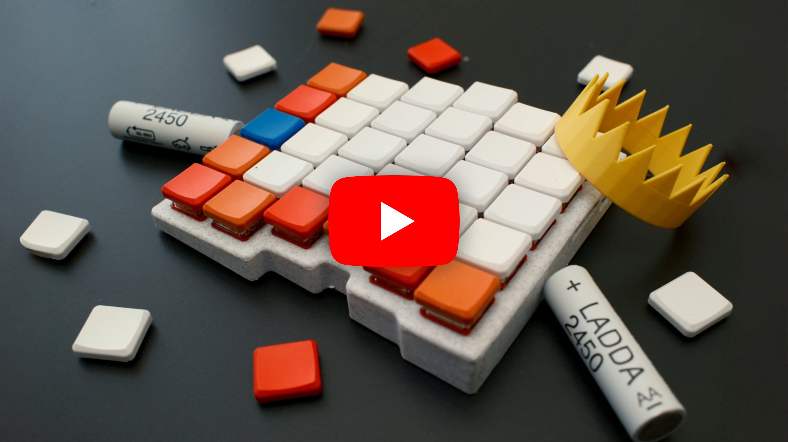

# ⌨️ Caldera Keyboard

This repo contains:

- The [Ergogen](https://github.com/ergogen/ergogen) v4 `config.yaml` file
- The outputted PCB files for use in KiCad (both the wired and uncompleted versions) available in the `ergogen` directory
- The left key plate JSCAD file generated by Ergogen (as well as the converted STL version). Note that no right side is included as in Fusion 360 I simply build out the case using the left side and then mirror the case with some modifications
- The ZMK firmware files for Caldera
- The completed case files for 3D printing can be found here: https://makerworld.com/en/models/545431

## Video

A full overview of the build process for this keyboard can be found on YouTube here: https://www.youtube.com/watch?v=7UXsD7nSfDY

## Instructions

If you're interested in building a Caldera keyboard, you can use the left and right `gerber.zip` files in this directory and upload those to a PCB manufacturer like JLCPCB or PCBWay (neither are sponsors) to obtain the PCBs. Then it's just a matter of acquiring the other keyboard parts from a site like Typeractive, and following the steps in the video above (soldering, assembling, flashing firmware).

# Ergogen config.yaml overview

The Ergogen `config.yaml` file used for this keyboard is expanded upon versus the overview in the YouTube video above, and while there's comments throughout the file to help, I wanted to give a somewhat more substantial overview of how the file works.

## Mirror strategy

One important point is that when building a PCB for split keyboards, many people build a reversible PCB so that the same PCB can be used for both the left and right side, the benefits being you're only maintaining one PCB and when ordering PCBs from manufacturers (which often have a minimum order size of 5), you can just order the 5, rather than using a separate PCB for the left and right side and needing to order 5 of *each*, which can feel excessive.

All that to say, Caldera does *not* use a reversible PCB. 😄 Why? 

- I'm just learning Ergogen and KiCad, making the PCB reversible seemed like it added a lot of complexity that wasn't immediately clear to me, so this feels a bit more beginner friendly
- Since Caldera stashes the controller underneath the actual keys (unlike most keyboards which have it separated in its own area), it was quite challenging to maneuver all the controller pins/holes so they wouldn't run into keys/diodes/etc., making the PCB reversible would have made an already difficult task much more so
- Most of the cost in ordering PCBs is the shipping, so ordering 5 PCBs versus 10 PCBs isn't a big deal, if anything it's just more PCBs to have in case you mess something up somehow

This is accomplished through Ergogen's `mirror_` suffix which allows you to create a mirrored image of a specific component. However both sides of the keyboard still maintain the same controller pin locations, and are simply horizontally mirrored.

## Outlines

There may be simpler ways to define the outlines of the PCB, but I elected to define the points (like the anchor point tool in Figma/Sketch/Illustrator) for more control.

## Component positioning

The Ergogen config uses a lot of custom positioning to allow for the controller to fit underneath the board properly or around mounting holes, which can make routing traces a bit trickier but still totally possible. 

For instance diodes aren't uniformly placed, you can see this in the `config.yaml` where I use regex extensively to apply positioning to only specific diodes, for example whether or not they start with `mirror_` or start with `matrix_`, which dictates which side of the board they're on. I also use regex to target specific rows or columns.

## KiCad

Ergogen outputs PCBs to be wired up in KiCad, which is a relatively simple and honestly kinda fun task. Note that you sometimes end up with `.kicad_proj` files, and you can safely ignore those and just use the `.kicad_pcb` files directly.

One area I didn't touch on in the video was the concept of Vias. Remember, you have two sides of your PCB (in KiCad, the red side, and the blue side), which you can use to your routing advantage. When routing traces in KiCad, sometimes you'll hit a situation where you need to run a trace but another trace is in the way of your path. Sometimes the best way to solve this is to use a Via, which just creates a hole in the PCB to the other side so you can safely route your trace on the other side where there hopefully isn't also something in the way, and if need be, you can Via back to the other side to finish the trace. Very handy, but try not to abuse it too much versus just being smart with your routing (I use it probably a bit more than I should as a beginner, but it's not the end of the world).

A warning you might receive in KiCad when routing the Ergogen schematic is: `Warning: The current configuration does not include the library ''.` From all I can gather, this is just a bug that has no meaningful effect, and you can safely ignore it. There's also a bunch of warnings for `Warning: Silkscreen clipped by solder mask`, this one I don't fully understand (my understanding is the silkscreen is *on top* of the solder mask, so not sure how that's possible), but it's only a warning, not an error, so it's not something I've had any issue ignoring. From what I gather it *might* refer to the silkscreen being cut out by holes in the solder mask/PCB, but again, we're just using the silkscreen as labels, so not to worry if that is the case.

However you do always want to run the Design Rules Checker (DRC aka The Validator) to see if you have any actual errors, and can also help you find which traces are unrouted.

## Cases

I use the handy Ergogen `cases` feature to easily use the key positioning to generate a 3D model file for the plate that the key switches click into, which is much nicer than manually doing everything in CAD software (which I use after Ergogen did a bunch of the heavy lifting). And yeah a 3D printed key plate in PLA is more than strong enough.

## Nothin' fancy

There are changes you could make to this PCB design to make it better, but I did not do:

- Change track width in KiCad. This would give you more resilient, sturdier traces for the electricity to pass through, but I just used the thinner KiCad default. Easier to route and honestly for keyboards and the tiny amount of electricity flowing it really feels negligible, but you can always re-trace the PCB yourself in KiCad with thicker traces!
- Reversible PCB: I did not do this, see *Mirror strategy* for why
- Ground plane: some folks build a ground plane into the PCB rather than requiring wiring directly to a ground pin. I'm not going to lie, I don't 100% understand this, it confused me, and from what I read seemed also negligible for keyboard PCBs, but would be a fun extra thing to learn!

